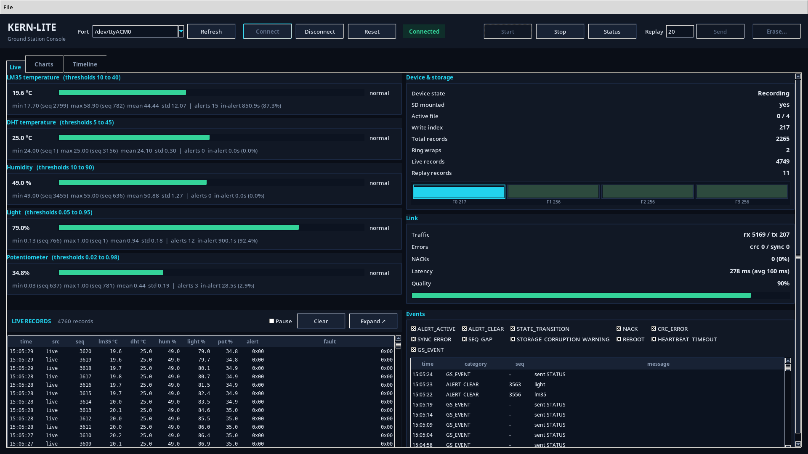
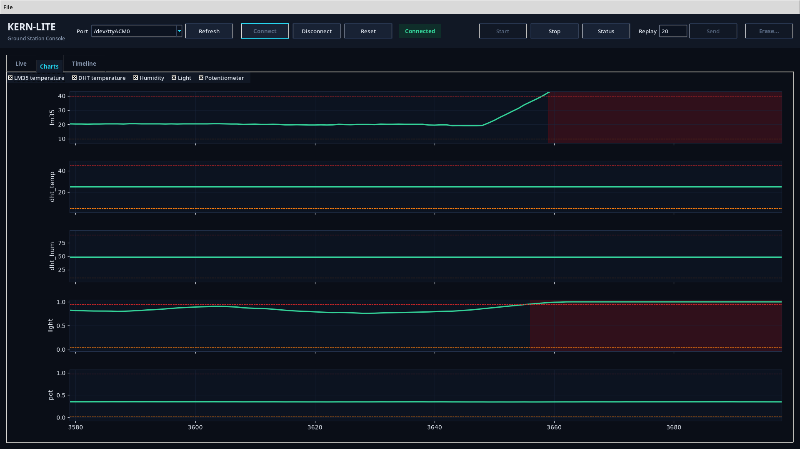
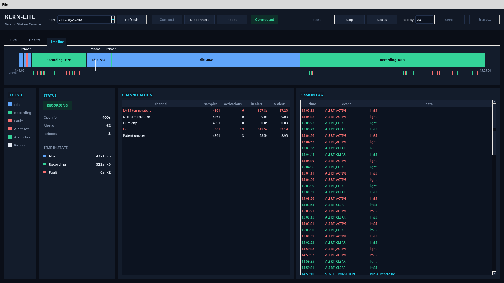

# KERN-LITE


Fault aware black box data logger on an STM32L476RG (NUCLEO-L476RG) with a Python
ground station.

Samples five sensor channels at 10 Hz, filters them, and writes CRC protected 32
byte records to a circular log on SD. Live telemetry streams over UART to a
Python dashboard with charts, stats, replay and exports. Records survive power
loss: each carries its own CRC and the write head is rebuilt after reset.

| Ground station console, live recording session |
| :--: |
|  |

| Charts | Timeline |
| :--: | :--: |
|  |  |

## Status

- [x] Phase 0: project setup, RTOS smoke test
- [x] Phase 1: CRC-32 and frame codec
- [x] Phase 2: UART round trip (STATUS/ACK)
- [x] Phase 3: sensors, DSP, live SensorRecord stream
- [x] Phase 4: circular file storage, replay, recovery
- [x] Phase 5: state machine, full command set
- [x] Phase 6: ground station analytics
- [x] Phase 7: fault injection, validation, demo

## Wiring and pinout

| Pin | Signal | Mode |
| --- | --- | --- |
| PA2/PA3 | USART2 TX/RX | AF7, ST-Link VCOM |
| PA5/PA6/PA7 | SPI1 SCK/MISO/MOSI | SD card |
| PB6 | SD_CS | GPIO out, idle HIGH |
| PB5 | DHT_DATA | Open drain, idle HIGH |
| PA0/PA1/PA4 | Pot/Photodiode/LM35 | ADC1 IN5/IN6/IN9 |
| PB4 | Buzzer | TIM3_CH1 PWM |
| PC9 | Heartbeat LED | GPIO out |
| PB8 | Fault LED | GPIO out |
| PA10/PB3 | SW1/SW2 | GPIO in / EXTI3 |

Clock: HSE 8 MHz, PLL to 80 MHz SYSCLK. UART link: ST-Link VCOM, 115200 8N1.

## Build and flash

STM32CubeIDE project, the IDE bundles the toolchain and ST-Link tools.
Pin config is in `kern-lite.ioc`.

1. Import the repo root as an existing project.
2. Project > Build All.
3. Run, flashes over the onboard ST-Link.

To flash an already built image without the IDE (needs STM32CubeProgrammer):

```sh
STM32_Programmer_CLI -c port=SWD -w Debug/kern-lite.elf -v -rst
```

## Ground station

Requires Python 3. All commands run from the repo root.

1. First time setup:

   ```sh
   python -m venv .venv
   .venv/bin/pip install -r requirements.txt
   ```

   > On Windows replace `.venv/bin/` with `.venv\Scripts\`. The GUI uses Tkinter; on Linux install `python3-tk` if missing.

2. Run the operator dashboard:

   ```sh
   .venv/bin/python -m dashboard
   ```

3. Connect with your port. Each connect creates a new `sessions/<timestamp>/` directory.

Other entry points:

- Headless gate probe (full end to end checklist):

  ```sh
  .venv/bin/python -m groundstation.probe --port /dev/ttyACM0
  ```

- Device simulator, to try the dashboard without hardware:

  ```sh
  .venv/bin/python -m dashboard.sim
  ```

- Python REPL for talking to the board by hand: [ground_station_cli.md](docs/ground_station_cli.md).

## Command set

| Command | Payload | Valid state | Effect |
| --- | --- | --- | --- |
| START | none | Idle | begin recording |
| STOP | none | Recording | stop recording |
| STATUS | none | any | board state snapshot |
| REPLAY | count (u16) | Idle, SD mounted | stream stored records |
| ERASE | magic `0xDEADC0DE` | Idle | wipe the log |

## Configured constants

Defined in `firmware/system/config.hpp`:

| Constant | Value | Meaning |
| --- | --- | --- |
| sample rate | 10 Hz | 100 ms sensor task period |
| `LOG_FILE_COUNT` | 4 | files in the circular log |
| `RECORDS_PER_FILE` | 256 | records per file, 1024 total |
| `META_FLUSH_EVERY_N` | 16 | metadata flush interval |
| `kUartBaud` | 115200 | link baud rate |
| `kDspWindow` | 16 | moving average window |
| `kEraseMagic` | 0xDEADC0DE | ERASE authorization magic |
| `kMaxWriteFails` | 3 | SD failures before Fault |

## Tests

- All tests (Python + host C++):

  ```sh
  make -C tests run
  ```

- Only Python suites:

  ```sh
  .venv/bin/pytest -v
  ```

- Only host C++ suites:

  ```sh
  make -C tests run-host
  ```

> CRC known answer: `CRC32("123456789") = 0xCBF43926`.

## Layout

```
firmware/            C++17 application
  system/            boot, tasks, orchestrator, config
  sensors/           LM35, DHT11, photodiode, pot, buttons
  dsp/               filters and threshold alerts
  protocol/          frame codec, CRC-32
  storage/           circular log over FatFs
  recorder/          state machine, command handling
  hal/               gpio, adc, watchdog wrappers
Core/ Drivers/
Middlewares/ FATFS/  CubeMX generated code
kern-lite.ioc        pin and peripheral config
groundstation/       Python link, telemetry, analytics
dashboard/           operator console and simulator
tests/
  host/              C++ suites (FatFs shim)
  gs/                pytest suites
  hw/                on target gate scripts
docs/                spec, design note, validation results
sessions/            dashboard run output (generated)
```

## Team

| Member | Main areas |
| --- | --- |
| [shalom2552](https://github.com/shalom2552) | recorder, storage, ground station, dashboard |
| [Yair-Dekel](https://github.com/Yair-Dekel) | board bring up, protocol, CubeMX/HAL glue |
| [Smallejoo](https://github.com/Smallejoo) | sensors, DSP, tests |

## License

MIT, see [LICENSE](LICENSE).
